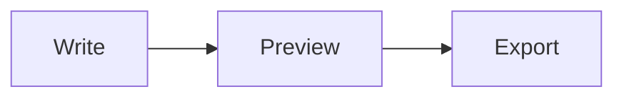

# mdfor.dev

[](https://github.com/ikhattab/md-preview/actions/workflows/ci.yml)
[](LICENSE)
[](https://mdfor.dev)

A fast, private markdown editor with live preview that runs entirely in your browser. No accounts, no backend, no tracking: your writing never leaves your device.

**Try it at [mdfor.dev](https://mdfor.dev).** (`mdfor.work` redirects there.)

https://github.com/user-attachments/assets/2c939b81-dc71-47d6-9a8c-8cd2fbd9ffe4

## Contents

- [Why mdfor.dev](#why-mdfordev)
- [Features](#features)
- [Supported syntax](#supported-syntax)
- [Privacy and security](#privacy-and-security)
- [Getting started](#getting-started)
- [Scripts](#scripts)
- [Deployment](#deployment)
- [Architecture](#architecture)
- [Contributing](#contributing)
- [License](#license)

## Why mdfor.dev

- **Private by design.** Everything happens client-side. Content and settings are stored only in your browser's `localStorage`.
- **Fast to open.** No UI framework, and heavy renderers (syntax highlighting, math, diagrams) load only when your document needs them.
- **Self-contained.** Scripts, styles, and fonts are bundled and served from the same origin. No third-party CDNs.

## Features

### Writing

- Live preview as you type, with GitHub Flavored Markdown and line breaks preserved
- Line-number gutter and optional scroll sync between editor and preview
- Built-in markdown linting with a clickable panel that jumps to the offending line
- Auto-save of your document and preferences (theme, pane width, collapsed editor, scroll sync, linting, remote image blocking)
- A rich starter document that shows off what the editor can render

### Rendering

- Syntax-highlighted code blocks via [highlight.js](https://highlightjs.org/), themed to match light or dark mode
- Math with [KaTeX](https://katex.org/) and diagrams with [Mermaid](https://mermaid.js.org/)
- YAML frontmatter at the top of a file shown as a small metadata table, like GitHub
- Fullscreen viewer for images and diagrams
- Optional blocking of remote images, with alt-text placeholders and a **Load images** button
- Mermaid diagram toolbar to view full screen, copy as PNG, or download as PNG
- All rendered HTML sanitized with [DOMPurify](https://github.com/cure53/DOMPurify)

### Import and export

- Import `.md`, `.markdown`, or `.txt` files with the file picker or by dragging a file onto the editor (you're asked before your current content is replaced)
- Export as:
  - **Markdown** (`.md`) source
  - **HTML**: a self-contained file with embedded styles and optional base64-inlined images
  - **PDF** through the browser's print dialog (choose "Save as PDF")

### Layout

- Resizable split panes (drag the handle, or focus it and use the arrow keys)
- Collapsible editor for distraction-free reading
- Light and dark themes
- Responsive layout with editor/preview tabs on mobile

## Supported syntax

Everything in [GitHub Flavored Markdown](https://github.github.com/gfm/) (tables, task lists, strikethrough, autolinks, fenced code), plus:

````markdown
Inline math: $E = mc^2$

$$
\int_0^\infty e^{-x^2}\,dx = \frac{\sqrt{\pi}}{2}
$$


````

### Lint rules

Linting is off by default; turn it on from the header. The rules follow [markdownlint](https://github.com/DavidAnson/markdownlint) numbering:

| Rule  | Checks for                             |
| ----- | -------------------------------------- |
| MD009 | Trailing spaces                        |
| MD010 | Hard tabs                              |
| MD012 | Multiple consecutive blank lines       |
| MD018 | No space after `#` in a heading        |
| MD022 | Headings not surrounded by blank lines |
| MD037 | Spaces inside emphasis or bold markers |
| MD041 | First line isn't a top-level heading   |
| MD047 | File doesn't end with a newline        |

## Privacy and security

- Your markdown and settings stay on your device. Nothing is sent to a server.
- The production site ships a strict Content Security Policy (see [`_headers`](_headers)): scripts, fonts, and network connections are limited to the same origin, and the app can't be embedded in frames.
- Images referenced in your markdown by URL are fetched from those URLs by default, which reveals your IP address to their hosts. Turn on **Block remote images** in the header to stop this: remote images (including ones in raw HTML, inline styles, and Mermaid diagrams) show as placeholders with their alt text, and **Load images** loads them for the current document. Images from the same site and `data:` URLs always load.
- If `localStorage` is unavailable (for example, in some private browsing modes), the app still works but won't remember your content or settings.

To report a vulnerability, see [SECURITY.md](SECURITY.md).

## Getting started

Prerequisites: Node.js 20.19+ (or 22.12+) and npm.

```bash
git clone https://github.com/ikhattab/md-preview.git
cd md-preview
npm install
npm run dev      # Vite dev server at http://localhost:5173
```

For a production-like preview:

```bash
npm run build
npm run preview  # serves ./dist at http://localhost:3000 with the headers from _headers
```

## Scripts

| Command                | Description                                          |
| ---------------------- | ---------------------------------------------------- |
| `npm run dev`          | Vite dev server with hot reload                      |
| `npm run build`        | Production build to `dist/`                          |
| `npm run preview`      | Serve the production build on port 3000              |
| `npm run lint`         | Run ESLint                                           |
| `npm run lint:fix`     | Run ESLint with autofix                              |
| `npm run format`       | Format all files with Prettier                       |
| `npm run format:check` | Check formatting with Prettier                       |
| `npm run check`        | Lint and format check (CI runs this, then the build) |
| `npm run test:e2e`     | Playwright smoke tests against the production build  |

## Deployment

Pushes to `main` deploy automatically to **Cloudflare Pages** (the `md-preview` project), served at [mdfor.dev](https://mdfor.dev):

- Build command: `npm run build`
- Output directory: `dist`

The output is a plain static site, so any static host works (Netlify, S3, nginx, and so on): run `npm run build` and serve `dist/`. [`_headers`](_headers) sets long-lived caching for hashed assets and the Content Security Policy on hosts that support that file format; on other hosts, configure the equivalent headers yourself.

## Architecture

Plain HTML, CSS, and ES modules, bundled and code-split by [Vite](https://vite.dev/). Markdown is parsed by [marked](https://marked.js.org/) with `marked-highlight` and `marked-katex-extension`; icons come from [Lucide](https://lucide.dev/), and fonts are self-hosted via [Fontsource](https://fontsource.org/).

<details>
<summary>Project structure</summary>

| Path                            | Purpose                                                  |
| ------------------------------- | -------------------------------------------------------- |
| `index.html`                    | Layout and entry point                                   |
| `app.js`                        | Initialization and event wiring                          |
| `styles.css`                    | Theming, layout, and responsive styles                   |
| `lib/constants.js`              | Shared constants and the starter document                |
| `lib/dom.js`                    | DOM element references                                   |
| `lib/storage.js`                | `localStorage` helpers                                   |
| `lib/utils.js`                  | Debounce, throttle, and string helpers                   |
| `lib/preview.js`                | Markdown parsing, sanitization, Mermaid, preview updates |
| `lib/frontmatter.js`            | YAML frontmatter detection and metadata table            |
| `lib/gutter.js`                 | Line-number gutter                                       |
| `lib/lint.js`                   | Lint rules and panel UI                                  |
| `lib/theme.js`                  | Theme loading and toggling                               |
| `lib/layout.js`                 | Resize, collapse, mobile view, scroll sync               |
| `lib/header-menu.js`            | Mobile overflow menu for the header controls             |
| `lib/content.js`                | Auto-save and content loading                            |
| `lib/import-export.js`          | Import and Markdown/HTML/PDF export                      |
| `lib/lazy-vendors.js`           | Lazy loading for highlight.js, KaTeX, and Mermaid        |
| `lib/media-viewer.js`           | Fullscreen image and diagram viewer                      |
| `lib/remote-images.js`          | Remote image blocking and placeholders                   |
| `lib/icons.js`                  | Lucide icon helpers                                      |
| `lib/tooltip.js`                | Viewport-aware tooltips                                  |
| `lib/fonts.js`                  | Self-hosted font imports                                 |
| `vite.config.js`                | Build configuration                                      |
| `scripts/cloudflare-headers.js` | Applies `_headers` in `vite preview`                     |
| `scripts/og-image.html`         | Source page for the social preview image                 |
| `_headers`                      | Cache and security headers for static hosting            |
| `site.webmanifest`              | Web app manifest                                         |

</details>

## Contributing

Contributions are welcome. Read [CONTRIBUTING.md](CONTRIBUTING.md) for setup and guidelines. In short: keep the app private (no network requests or CDNs), lazy-load anything heavy, sanitize rendered HTML, and run `npm run check && npm run build` before opening a pull request. CI runs the same checks on every PR.

Found a bug or have an idea? [Open an issue](https://github.com/ikhattab/md-preview/issues/new/choose).

## License

[MIT](LICENSE) © Ihab Khattab
