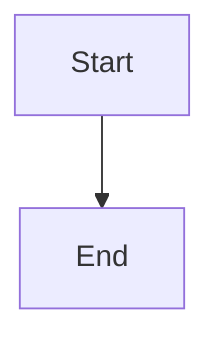

# Smoke Test

Some **bold**, _italic_, `inline code` and a [link](https://example.com).

This paragraph is hard-wrapped
across several lines
and renders as one line.

First line with a hard break\
second line.

Jump to [the links section](#links) or [the second repeat](#repeat-1).

| Name  | Value |
| ----- | ----- |
| alpha | 1     |

- [x] done
- [ ] todo

Write to [the team](mailto:team@example.com), follow <a href="https://example.org/raw">a raw HTML link</a>, or go [back to the top](#smoke-test).

```js
const answer = 42;
```

Inline math $E = mc^2$ and a block:

$$
\int_0^1 x^2 \, dx
$$




> [!NOTE]
> Useful information that users should know.

> [!TIP]
> Helpful advice for doing things better.

> [!IMPORTANT]
> Key information users need to know.
>
> Spanning **two** paragraphs.

> [!WARNING]
> Urgent info that needs immediate attention.

> [!CAUTION]
> Advises about risks or negative outcomes.

---

## Links

### Repeat

### Repeat

<script>window.__xss = 'script';</script>
<div onclick="window.__xss = 'handler'">untrusted div</div>
<a href="javascript:window.__xss = 'href'">untrusted link</a>
